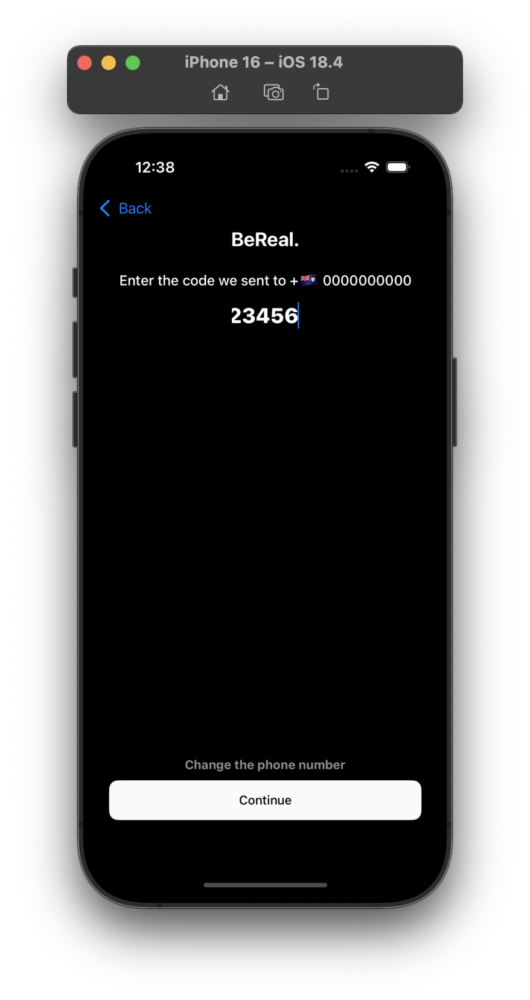
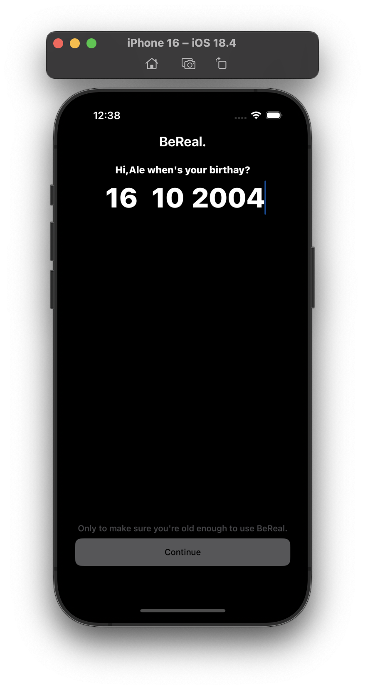
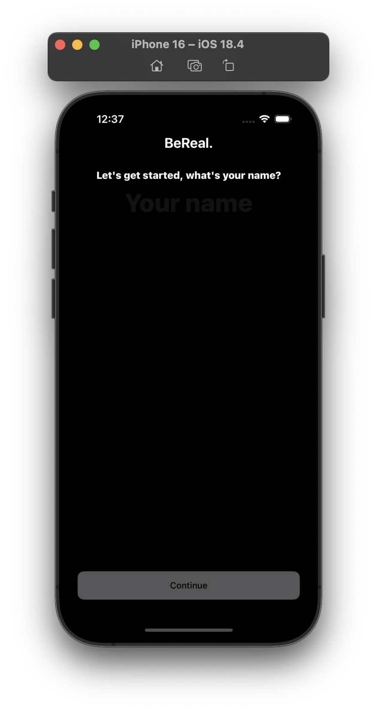
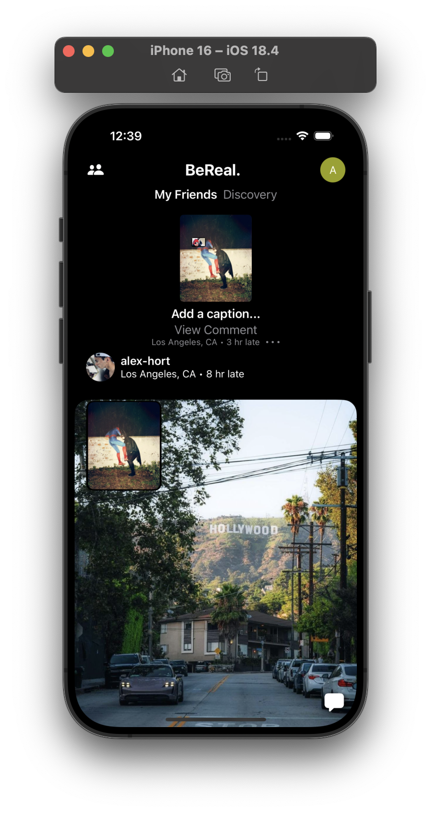
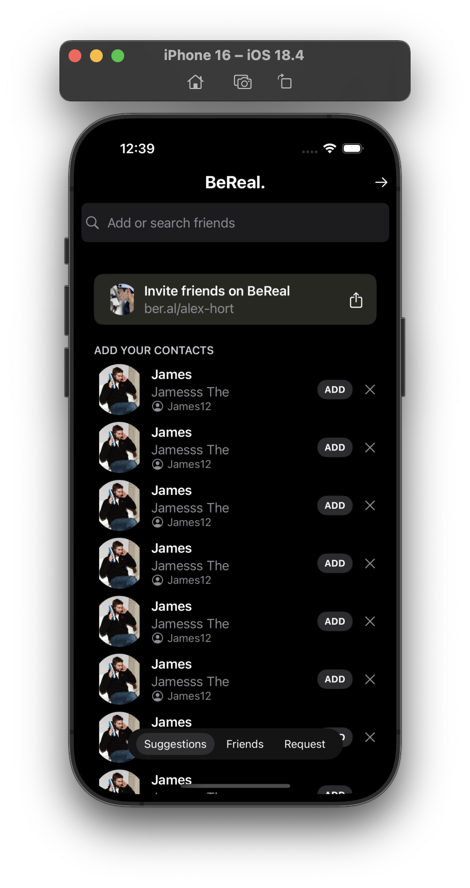
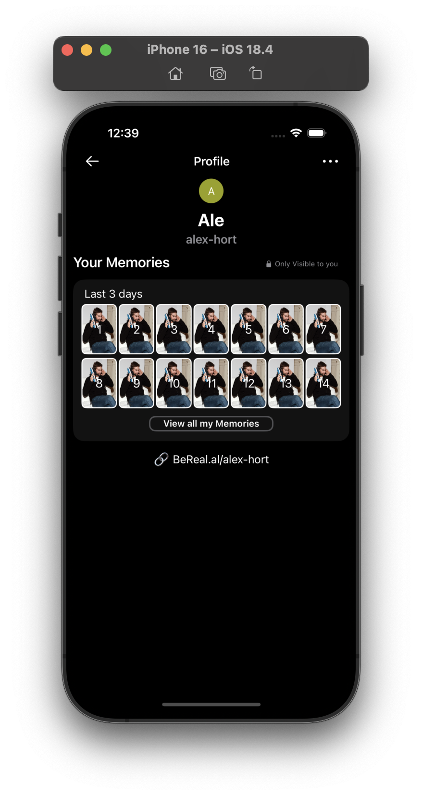
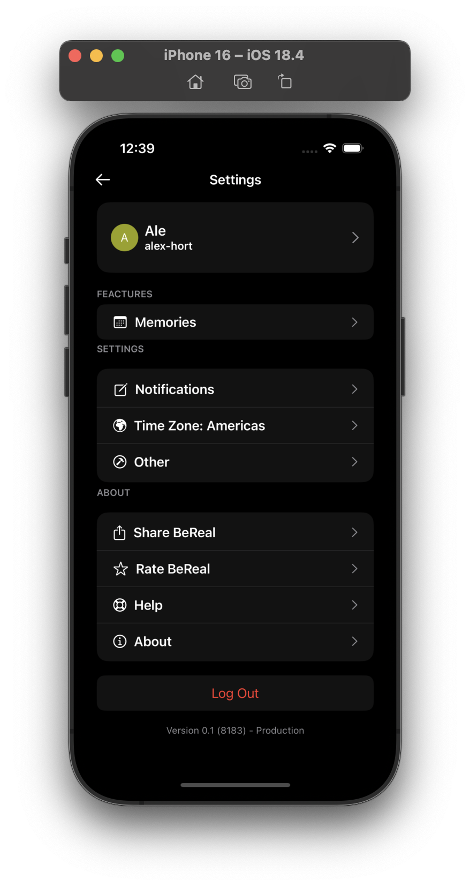

📸 BeReal — SwiftUI Clone (iOS 17)

A fully functional clone of BeReal, built entirely with SwiftUI 5, Firebase, and modern iOS APIs and architectures.
This project replicates the main flow of the original BeReal app, including authentication, real-time UI updates, camera usage, feed display, and reusable modular components.

🚀 Key Features

📱 SwiftUI 5 with modern iOS 17 components

🔥 Firebase (Auth, Firestore, Storage)

🔗 UI binding using @State, @Binding, @ObservedObject

🌀 Async/Await integrated into Firebase calls

🎨 Menus and tools using SF Symbols and iOS 16+ UI elements

📐 Clean MVVM architecture

⚡ Fast development with reusable SwiftUI components

🔧 Features developed with Xcode 14 / iOS 17

📱 Tested on iPhone 14, 14 Pro, and 14 Pro Max

🧱 Technologies Used

SwiftUI 5

Swift 5.7

Firebase Authentication

Firebase Firestore

Firebase Storage

Combine (when required)

Camera API + PhotosUI

MVVM Architecture

## 📲 App Screenshots

### 🔐 Authentication

### 🏠 Main Interface

### 👤 User Features

