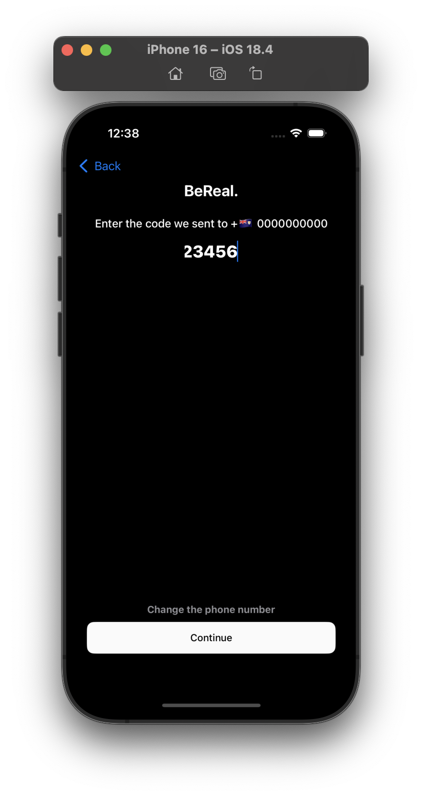
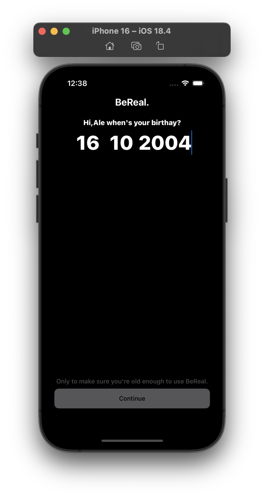
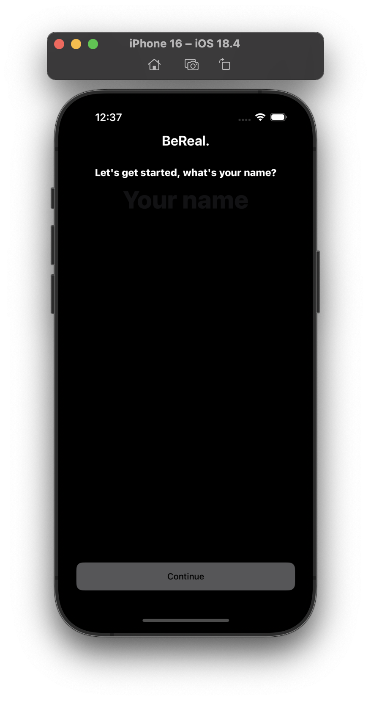
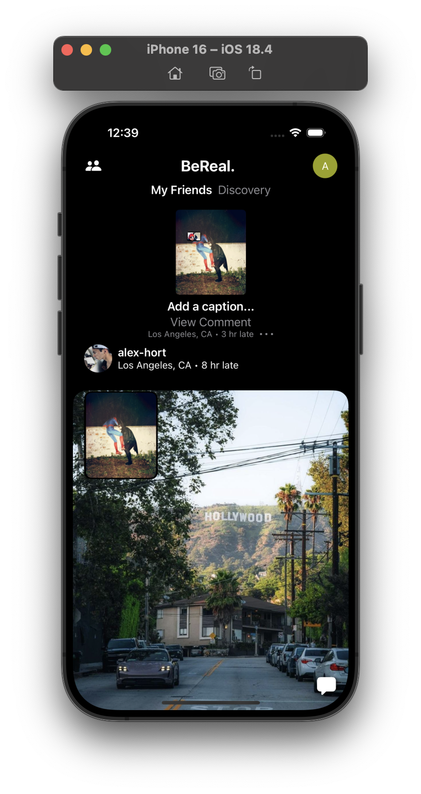
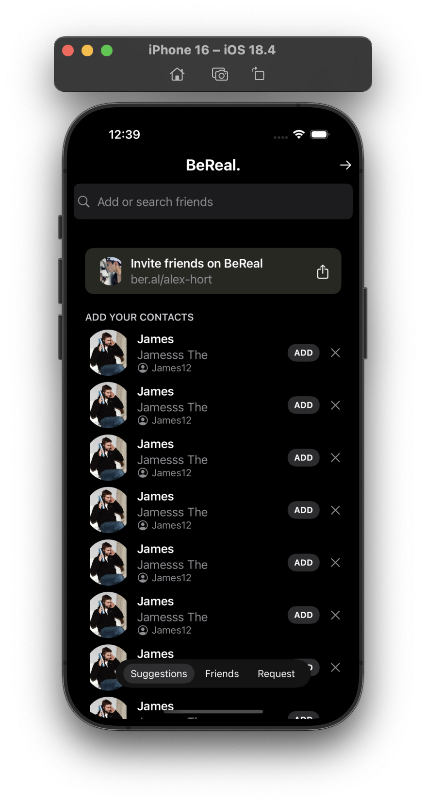
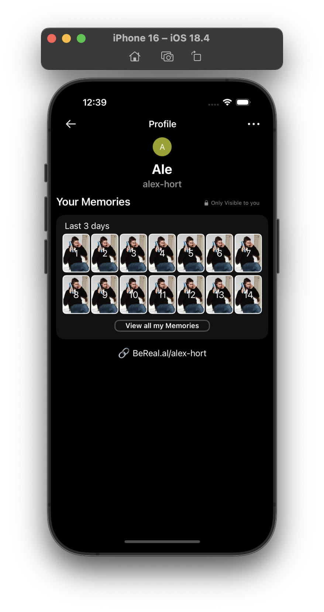
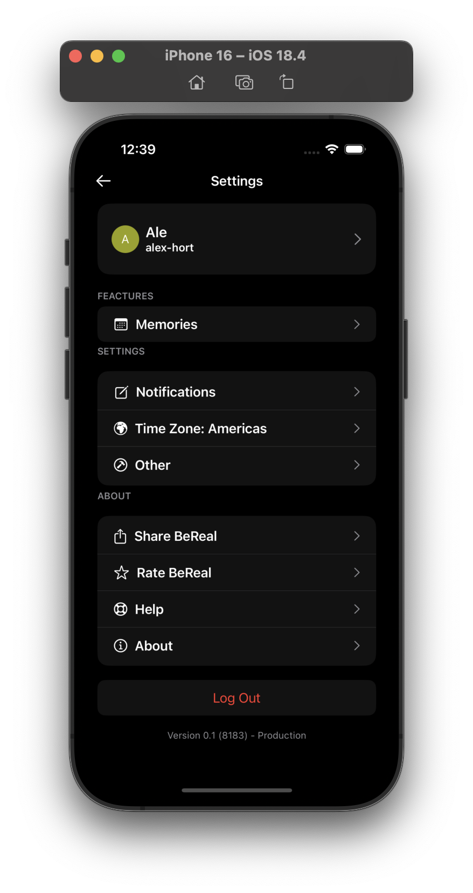

# 📸 BeReal — SwiftUI Clone (iOS 17)

> A fully functional clone of BeReal built entirely with SwiftUI 5, Firebase, and modern iOS APIs — replicating the real app's core flow: authentication, camera capture, real-time feed, and profile management.


This project recreates the main experience of the original BeReal app: phone number authentication, real-time UI updates powered by Firestore, native camera integration, a live feed, and a clean set of reusable, modular SwiftUI components.

## 📲 Screenshots

### 🔐 Authentication

| Phone Number Auth | Sign Up |
|:---:|:---:|
|  |  |

### 🏠 Main Interface

| Home | Feed | Suggestions |
|:---:|:---:|:---:|
|  |  |  |

### 👤 User Features

| Profile | Settings |
|:---:|:---:|
|  |  |

## ✨ Key Features

- 📱 **Phone number authentication** with Firebase Auth, replicating BeReal's onboarding flow
- 📷 **Native camera capture** using the Camera API + PhotosUI
- 🌐 **Real-time feed** — posts sync instantly across devices via Firestore listeners
- 👥 **Friend suggestions** screen for discovering and adding users
- 👤 **Profile & settings** screens with photo upload to Firebase Storage
- 🧩 **Reusable modular components** for fast, consistent UI development
- 🌀 **Async/Await** integrated into all Firebase calls for clean, modern concurrency
- 🎨 **Native look & feel** with SF Symbols and iOS 16+ UI elements (menus, sheets, toolbars)

## 🛠️ Tech Stack

| Layer | Technology |
|---|---|
| **UI** | SwiftUI 5, SF Symbols, iOS 16+ components |
| **Language** | Swift 5.7 (async/await, Combine when required) |
| **State management** | `@State`, `@Binding`, `@ObservedObject` |
| **Architecture** | MVVM with reusable view components |
| **Auth** | Firebase Authentication (phone number) |
| **Database** | Firebase Firestore (real-time listeners) |
| **Media storage** | Firebase Storage |
| **Camera** | AVFoundation Camera API + PhotosUI |
| **Tooling** | Xcode 14, iOS 17 SDK |

## 🏗️ Architecture

The app follows a clean **MVVM** structure:

```
Views (SwiftUI)  ──►  ViewModels (ObservableObject)  ──►  Services (Firebase)
     ▲                        │                                │
     └── @Published state ◄───┘        async/await calls ◄─────┘
```

- **Views** are lightweight and declarative, composed from reusable components.
- **ViewModels** expose `@Published` state and handle user intent.
- **Services** wrap Firebase Auth, Firestore, and Storage behind async/await APIs.

## 🚀 Getting Started

### Prerequisites
- macOS with **Xcode 14+**
- An iOS 17 device or simulator
- A **Firebase** project with Authentication (Phone), Firestore, and Storage enabled

### Installation

```bash
# 1. Clone the repository
git clone https://github.com/alex-hort/BeReal
cd bereal-clone

# 2. Add your Firebase configuration
#    Download GoogleService-Info.plist from the Firebase Console
#    and drag it into the Xcode project.

# 3. Open and run
open BeRealClone.xcodeproj   # Build & run with ⌘R
```

> 📷 Camera features require a physical device — the simulator has no camera.

## 📱 Tested On

- iPhone 14
- iPhone 14 Pro
- iPhone 14 Pro Max

## ⚠️ Disclaimer

This is an educational project built for learning purposes. BeReal and its brand assets belong to their respective owners; this clone is not affiliated with or endorsed by BeReal.

## 📄 License

This project is licensed under the MIT License.

